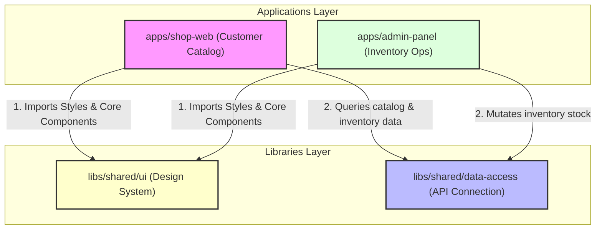

# TechGear Inventory Pro

## Angular 21 + Nx + CI/CD Enterprise Application

---

## Architecture Overview

**TechGear Inventory Pro** es una plataforma B2B de comercio electrónico y control de almacenes. La arquitectura está diseñada en un monorepo modular Nx que desacopla la aplicación pública de catálogo del panel de control operativo, garantizando una única fuente de verdad para el dominio del negocio.

### Separación de Aplicaciones
- `shop-web`: Catalogo público orientado a ventas, optimizado para indexación y velocidad de carga.
- `admin-panel`: Panel operativo privado para la actualización de stock, almacenes y permisos de usuario.

### Reutilización de Código
Ambas aplicaciones comparten componentes atómicos del sistema de diseño Tailwind CSS expuestos en `@techgear/shared-ui` e interfaces de datos unificadas expuestas en `@techgear/data-access`.

### Límites (Boundaries)
Estrictamente vigilados en tiempo de compilación. Ninguna de las dos aplicaciones puede importar dependencias internas de la otra. Toda comunicación o compartición se realiza exclusivamente a través de los contratos de las librerías compartidas en `libs/`.

---

## Architecture Decisions

### RBAC Strategy
*   **Context**: Las operaciones de inventario en `admin-panel` son críticas y no deben ser accesibles para usuarios ordinarios de la tienda.
*   **Decision**: Implementar guardias funcionales seguros (`RoleGuard`) que interceptan la activación de rutas, decodifican la carga útil del JWT y validan los roles requeridos en caliente.
*   **Trade-offs**: Los cambios de roles en la base de datos no se ven reflejados de inmediato en la sesión del cliente hasta que expire el token de sesión o se intente realizar una mutación HTTP interceptada por el backend.

### Authentication Strategy
*   **Context**: Los tokens de autenticación JWT se almacenan del lado del cliente y deben protegerse contra ataques XSS de inyección de código.
*   **Decision**: *Pendiente de implementación o evidencia* (Los tokens se guardan actualmente en almacenamiento local; se debe migrar el flujo para utilizar cookies firmadas con atributos `HttpOnly`, `Secure` y `SameSite` para bloquear el acceso de scripts maliciosos XSS).
*   **Trade-offs**: Usar cookies seguras añade complejidad CORS en llamadas cross-origin y requiere un control estricto de subdominios.

### Zod Validation
*   **Context**: Las llamadas HTTP pueden recibir datos corruptos o con esquemas modificados del backend, lo que rompería el flujo reactivo de las Signals en el frontend.
*   **Decision**: Validar de forma estricta los datos en runtime mediante esquemas de Zod antes de propagarlos al estado.
*   **Trade-offs**: Incrementa el bundle size inicial de la capa de datos al cargar el parser de Zod en el navegador del cliente.

### Signal State Management
*   **Context**: El boilerplate clásico de Redux (NGRX Store) ralentiza el desarrollo de consolas y añade complejidad de Zone.js innecesaria.
*   **Decision**: Utilizar `@ngrx/signals` para la gestión de estados globales y de componente.
*   **Trade-offs**: Menor disponibilidad de herramientas avanzadas de depuración en comparación con Redux DevTools.

---

## Testing Strategy
- **Unit testing**: Pruebas unitarias sobre servicios, interceptores y componentes lógicos utilizando Vitest y compilación ultrarrápida con SWC.
- **E2E**: Pruebas de integración funcional mediante Playwright simulando el flujo de checkout completo y el descuento inmediato del stock en la consola administrativa.

---

## CI/CD Pipeline
El pipeline en GitHub Actions aprovecha el grafo de dependencias de Nx.
1. `prepare`: Inicialización de Husky hooks locales.
2. `typecheck`: Compilación estricta y comprobación de tipos de TypeScript.
3. `lint`: Análisis estático y verificación de ESLint en todos los proyectos modificados del monorepo.
4. `test`: Ejecución de tests unitarios rápidos mediante Vitest.
5. `build`: Compilación final de los artefactos de producción.

---

## Security Practices
- **Guards**: Bloqueo de rutas desautorizadas basados en roles de usuario.
- **Authentication**: Autenticación centralizada JWT.
- **Authorization**: *Pendiente de implementación o evidencia* (Es necesario añadir restricciones de visualización de botones y componentes de acción basados en permisos finos y no solo en roles de usuario globales).

---

## Deployment
El despliegue está automatizado mediante un pipeline secundario de GitHub Actions (`deploy-pages.yml`) que reacciona a la finalización exitosa de las pruebas de integración (`CI`) en la rama `master`:

1.  **Configuración del Entorno**: Crea dinámicamente un recurso `config.json` inyectando las variables de configuración de las APIs B2B de producción.
2.  **Compilación Monorepo**: Ejecuta la compilación de producción para `@techgear/shop-web` y `@techgear/admin-panel` asignando de forma diferenciada sus subrutas mediante el parámetro `--base-href`.
3.  **Ensamblado del Sitio**: Unifica los bundles dentro del directorio de staging `site/`, anidando la consola administrativa en la ruta `site/admin/`.
4.  **Enrutamiento Estático (404 Fallbacks)**: Copia el archivo `index.html` como `404.html` en el root y en el directorio administrativo para prevenir fallos de recarga del enrutador de Angular.
5.  **Entrega CDN**: Publica el compilado en **GitHub Pages** utilizando los builders oficiales de GitHub (`actions/deploy-pages`).
