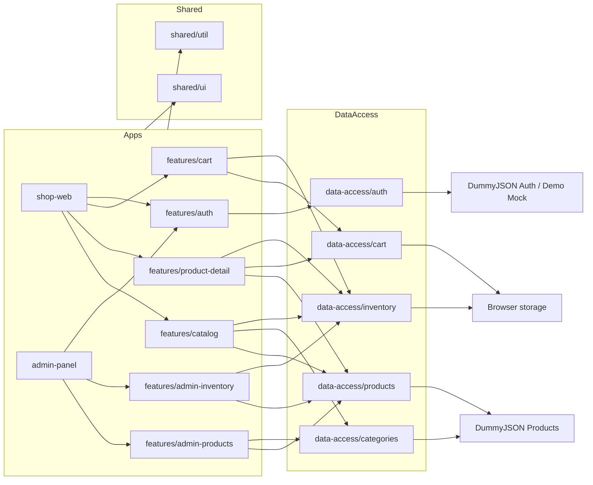

# TechGear Inventory Pro

[](https://github.com/lrangela/techgear-inventory-pro/actions/workflows/ci.yml)
[](https://lrangela.github.io/techgear-inventory-pro/)

- Repository: [https://github.com/lrangela/techgear-inventory-pro](https://github.com/lrangela/techgear-inventory-pro)
- Shop URL: [https://lrangela.github.io/techgear-inventory-pro/](https://lrangela.github.io/techgear-inventory-pro/)
- Admin URL: [https://lrangela.github.io/techgear-inventory-pro/admin/](https://lrangela.github.io/techgear-inventory-pro/admin/)

## English

### Real Problem

The project needed to demonstrate a serious Angular frontend architecture for two different business contexts:

- A customer storefront with catalog, detail, and cart flows.
- An internal admin area for product and inventory operations.

The main constraint is structural: the demo uses a third-party fake API (`DummyJSON`) and deploys to GitHub Pages, so there is no owned backend for secure cookies, real server-side authorization, durable inventory, or payment checkout.

### Solution

TechGear Inventory Pro is an Nx monorepo with two Angular standalone applications and reusable libraries.

- `shop-web` focuses on storefront UX.
- `admin-panel` focuses on controlled backoffice flows.
- Runtime contracts are validated with `zod`.
- Auth is split by environment:
  - `development/local`: remote auth against DummyJSON through `/api` proxy.
  - `production` on GitHub Pages: mock auth for stable public demo access.
- In remote mode, each login screen now loads an API-backed sample account from DummyJSON, shows the username, and prefills the password in the form without rendering the raw password in the UI:
  - `shop-web`: `/users/6` (`oliviaw`)
  - `admin-panel`: `/users/1` (`emilys`)
- Tokens no longer persist in `localStorage`; session auth state uses `sessionStorage` fallback to memory.
- Admin routes now require both authentication and admin role.
- Inventory is synchronized against the product catalog master list instead of allowing orphan items.
- Catalog filtering/pagination now uses real API parameters instead of filtering an already paginated page on the client.
- Checkout is explicitly labeled as a demo-only disabled capability.

### Architecture



### Stack

- Angular 21 standalone
- Nx 22
- TypeScript 5
- Signals + `@ngrx/signals`
- RxJS
- `zod`
- Tailwind CSS + SCSS
- Vitest
- Playwright
- GitHub Actions
- GitHub Pages
- DummyJSON

### Technical Decisions

- Use apps as composition roots and keep business behavior in libraries.
- Keep auth/session handling honest for a static demo:
  - no fake “secure production auth” claim,
  - session-scoped token persistence only,
  - explicit mock credentials only in Pages demo mode.
- Use frontend RBAC only as demo UX control for admin routing; it is not server-enforced security and must not be presented as real authorization.
- Keep inventory as a local operational projection synchronized from the catalog master list.
- Prefer API-backed category filtering and pagination over client-only approximations.
- Keep destructive actions explicit with confirmations and unsaved-changes guards.
- Add best-effort CSP meta tags for Pages and document that Trusted Types enforcement and frame-ancestors protection require server headers.

### Highlighted Features

- Dual application architecture with shared domain libraries.
- Role-aware admin routing.
- Session-based auth storage instead of long-lived `localStorage` tokens.
- Catalog pagination and category filtering aligned with DummyJSON capabilities.
- Admin product editor with unsaved changes protection.
- Inventory dashboard constrained to existing catalog products.
- Centralized error normalization.
- CI/CD for typecheck, lint, test, build, E2E, and Pages deploy.

### Current Limitations

- No owned backend means no real server-side authorization, audit trail, payment, or persistent stock truth.
- GitHub Pages cannot emit the same security headers as a custom backend.
- DummyJSON mutations are still demo-oriented and not business-grade persistence.
- Inventory and cart remain browser-scoped demo data.

### Workspace Structure

```text
techgear/
|-- apps/
|   |-- shop-web
|   `-- admin-panel
|-- libs/
|   |-- data-access/
|   |   |-- auth
|   |   |-- cart
|   |   |-- categories
|   |   |-- inventory
|   |   `-- products
|   |-- features/
|   |   |-- admin-inventory
|   |   |-- admin-products
|   |   |-- auth
|   |   |-- cart
|   |   |-- catalog
|   |   `-- product-detail
|   `-- shared/
|       |-- ui
|       `-- util
|-- docs/
|   `-- adr/
`-- .github/workflows/
```

### Runtime Configuration

The project uses a **Runtime Configuration** strategy to follow the "Build Once, Deploy Anywhere" principle.

- Configuration is stored in `assets/config.json`.
- `AppConfigService` loads this file during application startup (`APP_INITIALIZER`).
- This decouples the build artifact from environment-specific variables like `apiBaseUrl`.

### How To Run

```bash
npm install
npm run typecheck
npm run lint
npm run test
npm run build
npm run e2e
npx nx serve shop-web
npx nx serve admin-panel
```

Environment modes (defined in `assets/config.json`):

- `authMode: 'mock'`: GitHub Pages demo mode with mock auth.
- `authMode: 'remote'`: Connects to real `apiBaseUrl`.

### Demo Credentials

Pages demo credentials intentionally exist only for the public static demo:

- Shop:
  - Username: `shop-demo`
  - Password: `ShopDemo123!`
- Admin:
  - Username: `admin-demo`
  - Password: `AdminDemo123!`

In development mode, demo credentials are not rendered by default.

### Authorization Boundary

- Admin RBAC in this repository is frontend-only and demonstrative.
- Route guards improve UX and navigation control, but they do not replace backend authorization.
- Without an owned backend, the project does not provide server-enforced access control.

### How To Deploy

- CI runs on push, pull request, and manual dispatch.
- Pages deploy runs only after successful CI on `master`.
- The deploy builds:
  - `shop-web` at `/`
  - `admin-panel` at `/admin/`
- **Dynamic Configuration:** You can configure the demo by setting GitHub Repository Variables:
  - `API_BASE_URL`: The target API URL (default: `https://dummyjson.com`).
  - `AUTH_MODE`: `mock` or `remote` (default: `mock`).

### CI/CD Status

Verification executed on 2026-03-23:

- `npm run typecheck`: passes
- `npm run lint`: passes
- `npm run test -- --watch=false`: passes
- `npm run build`: passes with bundle-budget warnings
- `npm run e2e`: passes
- `npm run e2e:remote-auth`: passes
- `npm audit --omit=dev --audit-level=high`: reports unresolved upstream advisories

Current CI reality:

- The workflow definition is coherent and the Pages deploy condition matches the current default branch (`master`).
- `deploy-pages.yml` publishes `shop-web` to `/` and `admin-panel` to `/admin/` after successful CI on `master`.
- The build remains functional, but both apps currently exceed the warning budget:
  - `shop-web`: `675.92 kB` initial bundle vs `620 kB` warning budget
  - `admin-panel`: `681.20 kB` initial bundle vs `620 kB` warning budget
- `security-audit` is now non-blocking and uploads audit logs because Angular advisory `GHSA-g93w-mfhg-p222` still affects the installed Angular 21.1.x line. The risk remains visible in CI, but it no longer blocks functional delivery while upstream remediation is pending.
- Remote-auth E2E coverage is available via `npm run e2e:remote-auth`, runs against real DummyJSON credentials loaded in `development`, and passed in local verification on 2026-03-23.

### ADRs

- [ADR-0001 Architecture](./docs/adr/ADR-0001-architecture.md)
- [ADR-0002 Quality And Delivery](./docs/adr/ADR-0002-quality-and-delivery.md)
- [ADR-0003 Auth Strategy For Static Deploy](./docs/adr/ADR-0003-auth-strategy-static-deploy.md)

## Espanol

### Problema real

El proyecto debía demostrar una arquitectura frontend Angular seria para dos contextos de negocio:

- Una tienda para cliente con catálogo, detalle y carrito.
- Un backoffice interno para productos e inventario.

La restricción principal es arquitectónica: la demo usa una API fake de terceros (`DummyJSON`) y se despliega en GitHub Pages, por lo que no existe un backend propio para cookies seguras, autorización server-side real, persistencia empresarial de inventario o checkout.

### Solución

TechGear Inventory Pro es un monorepo Nx con dos aplicaciones Angular standalone y librerías reutilizables.

- `shop-web` se concentra en la experiencia storefront.
- `admin-panel` se concentra en flujos controlados de backoffice.
- Los contratos runtime se validan con `zod`.
- La autenticación se separa por ambiente:
  - `development/local`: auth remota contra DummyJSON por proxy `/api`.
  - `production` en GitHub Pages: auth mock para una demo pública estable.
- Los tokens ya no persisten en `localStorage`; la sesión usa `sessionStorage` con fallback en memoria.
- Las rutas admin exigen autenticación y rol `admin`.
- El inventario se sincroniza contra el maestro de productos.
- El catálogo usa paginación y filtro por categoría con capacidades reales de la API.
- El checkout quedó marcado explícitamente como demo y está deshabilitado.

### Arquitectura

El diagrama superior aplica también a la versión en español.

### Stack

- Angular 21 standalone
- Nx 22
- TypeScript 5
- Signals + `@ngrx/signals`
- RxJS
- `zod`
- Tailwind CSS + SCSS
- Vitest
- Playwright
- GitHub Actions
- GitHub Pages
- DummyJSON

### Decisiones técnicas

- Mantener `apps` como composition roots y la lógica reusable en `libs`.
- No simular una “seguridad real” inexistente en Pages:
  - nada de prometer cookies HttpOnly sin backend propio,
  - sesión persistida solo por pestaña,
  - credenciales demo visibles únicamente en modo mock público.
- Aplicar RBAC frontend en admin y documentar que la autorización real sigue dependiendo del backend.
- Tratar inventario como proyección operativa local del catálogo.
- Usar filtros/paginación de API en lugar de aproximaciones client-side engañosas.
- Agregar confirmaciones y protección ante cambios no guardados.
- Agregar CSP por meta tag como defensa parcial y documentar el límite de Trusted Types en Pages.

### Features destacadas

- Dos aplicaciones con librerías compartidas.
- Rutas admin con rol.
- Sesión basada en `sessionStorage`.
- Catálogo con filtrado/paginación real.
- Formulario admin con `canDeactivate`.
- Inventario ligado al catálogo.
- Normalización centralizada de errores.
- CI/CD completo con Pages.

### Límites actuales

- Sin backend propio no hay autorización server-side real, auditoría operativa, pagos ni verdad única de stock.
- GitHub Pages no emite todos los headers de seguridad que un backend propio sí puede controlar.
- Las mutaciones de DummyJSON siguen siendo de demo.
- Carrito e inventario siguen siendo datos locales de navegador.

### Configuración en Tiempo de Ejecución (Runtime)

El proyecto utiliza una estrategia de **Configuración en Runtime** para seguir el principio "Build Once, Deploy Anywhere".

- La configuración reside en `assets/config.json`.
- `AppConfigService` carga este archivo durante el arranque (`APP_INITIALIZER`).
- Esto desacopla el artefacto compilado de variables específicas del entorno como `apiBaseUrl`.

### Cómo correr

```bash
npm install
npm run typecheck
npm run lint
npm run test
npm run build
npm run e2e
npx nx serve shop-web
npx nx serve admin-panel
```

Modos de entorno (definidos en `assets/config.json`):

- `authMode: 'mock'`: Modo demo de GitHub Pages con auth simulada.
- `authMode: 'remote'`: Se conecta a la `apiBaseUrl` real.

### Cómo desplegar

- CI corre en push, pull request y disparo manual.
- El deploy a Pages corre solo después de CI exitoso en `master`.
- Se publica:
  - `shop-web` en `/`
  - `admin-panel` en `/admin/`
- **Configuración Dinámica:** Puedes configurar la demo estableciendo "Variables de Repositorio" en GitHub:
  - `API_BASE_URL`: La URL de la API destino (por defecto: `https://dummyjson.com`).
  - `AUTH_MODE`: `mock` o `remote` (por defecto: `mock`).

### Estado actual de CI/CD

Validacion ejecutada el 2026-03-23:

- `npm run typecheck`: pasa
- `npm run lint`: pasa
- `npm run test -- --watch=false`: pasa
- `npm run build`: pasa con warnings de budget
- `npm run e2e`: pasa
- `npm run e2e:remote-auth`: pasa
- `npm audit --omit=dev --audit-level=high`: reporta advisories pendientes

Realidad actual del pipeline:

- La definicion de CI es coherente y la condicion del deploy a Pages coincide con la rama actual (`master`).
- `deploy-pages.yml` publica `shop-web` en `/` y `admin-panel` en `/admin/` tras CI exitoso en `master`.
- El build es funcional, pero ambas apps exceden hoy el warning budget:
  - `shop-web`: `675.92 kB` iniciales vs `620 kB` de warning
  - `admin-panel`: `681.20 kB` iniciales vs `620 kB` de warning
- `security-audit` sigue visible pero ya no bloquea el pipeline por la advisory upstream de Angular `GHSA-g93w-mfhg-p222` en la linea instalada 21.1.x. El riesgo queda expuesto en CI, pero no impide validar el funcionamiento del frontend.
- La smoke suite de auth remota via `npm run e2e:remote-auth` corre contra DummyJSON real y también quedó validada el 2026-03-23.

### ADR

- [ADR-0001 Arquitectura](./docs/adr/ADR-0001-architecture.md)
- [ADR-0002 Calidad y Delivery](./docs/adr/ADR-0002-quality-and-delivery.md)
- [ADR-0003 Estrategia Auth Para Deploy Estatico](./docs/adr/ADR-0003-auth-strategy-static-deploy.md)
