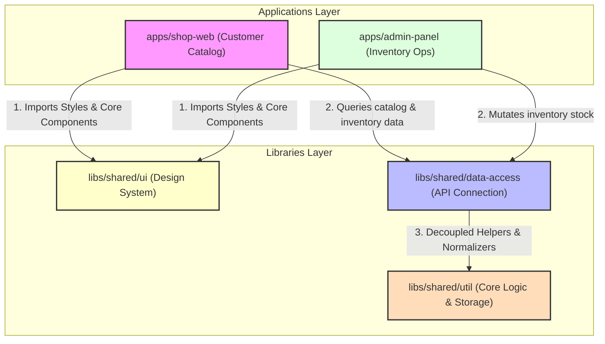

# TechGear Inventory Pro

## Angular 21 + Nx + CI/CD Enterprise Application

---

## Architecture Overview

**TechGear Inventory Pro** es una plataforma B2B de comercio electrónico y control de almacenes de alto rendimiento. La arquitectura está diseñada en un monorepo modular Nx que desacopla la aplicación pública de catálogo del panel de control operativo, garantizando una única fuente de verdad para el dominio del negocio.

### Separación de Aplicaciones
- `shop-web`: Catalogo público orientado a ventas, optimizado para indexación y velocidad de carga.
- `admin-panel`: Panel operativo privado para la actualización de stock, almacenes y permisos de usuario.

### Reutilización de Código
Ambas aplicaciones comparten componentes del sistema de diseño Tailwind CSS expuestos en `@techgear/ui` e interfaces de datos unificadas expuestas en `@techgear/data-access`.

### Límites (Boundaries)
Estrictamente vigilados en tiempo de compilación. Ninguna de las dos aplicaciones puede importar dependencias internas de la otra. Toda comunicación o compartición se realiza exclusivamente a través de los contratos de las librerías compartidas en `libs/`.

---

## Architectural Decisions Record (ADR)

### 1. Angular Zoneless & Signal-Driven State Management
*   **Contexto**: El framework de cambio de detección clásico basado en `Zone.js` introduce sobrecarga de rendimiento y dificulta la depuración de flujos asíncronos complejos.
*   **Decisión**: Adoptar Angular 21 con **Zoneless Change Detection** (`provideZonelessChangeDetection()`) y delegar la reactividad en **Signals** nativas de Angular. El estado global y del componente se gestiona mediante `@ngrx/signals` y componentes standalone puros. Se utiliza **`linkedSignal`** para resetear de forma limpia y reactiva estados temporales (como mensajes de éxito en formularios) en cuanto cambian sus dependencias.
*   **Trade-offs**: Requiere disciplina estricta de desarrollo (evitar lecturas imperativas fuera del grafo reactivo y asegurar que todas las vistas dependan únicamente de señales evaluadas).

### 2. Inversión de Dependencias en Almacenamiento (SSR-Safe)
*   **Contexto**: La persistencia local (localStorage/sessionStorage) acopla los componentes al navegador y provoca fallos catastróficos por excepciones de referencia de objeto (`ReferenceError`) en entornos Server-Side Rendering (SSR).
*   **Decisión**: Abstraer la persistencia física del navegador mediante la interfaz `ProductsStorage` y el token de inyección `PRODUCTS_STORAGE`. La implementación por defecto (`LocalStorageProductsStorage`) encapsula llamadas seguras con fallback en memoria (`Map`).
*   **Trade-offs**: Los datos en memoria no se conservan en refrescos de página en SSR, pero se garantiza la hidratación inicial del HTML sin errores y un entorno de tests unitarios independiente y paralelizable.

### 3. Validación y Normalización estricta de Datos (Zod Boundaries)
*   **Contexto**: DummyJSON y APIs externas presentan payload inestables (ej. categorías devueltas a veces como strings y otras como objetos) y la carga de datos corruptos puede corromper el estado global de la aplicación.
*   **Decisión**: Validar todos los datos externos (API y localStorage persistido) en la frontera mediante esquemas de **Zod** (`safeParse`), y normalizar las estructuras de datos antes de inyectarlas en los stores locales.
*   **Trade-offs**: Añade un pequeño paso de procesamiento y validación en tiempo de ejecución al inicializar datos locales o recibir respuestas HTTP.

### 4. Auth Semaphorization & SSR-Safe Refresh Gate
*   **Contexto**: En entornos de servidor (SSR), el uso de variables globales de módulo para guardar estados de refresco (`let isRefreshing = false`) provoca condiciones de carrera y fugas de tokens de sesión entre peticiones de diferentes usuarios concurrentes.
*   **Decisión**: Encapsular el estado del refresco y el semáforo RxJS en un servicio inyectable con ámbito de aplicación (`AuthRefreshGate`). Esto asegura que el estado del interceptor esté aislado en el contenedor DI por petición de renderizado en el servidor.
*   **Trade-offs**: Requiere proveer correctamente los interceptores funcionales integrados en el árbol DI.

---

## Testing Strategy
- **Unit testing**: Pruebas unitarias sobre servicios, interceptores y componentes utilizando Vitest y SWC. Los tests de storage se mockean mediante `vi.mock('@techgear/util')` para asegurar que corren en entornos puros sin DOM.
- **E2E**: Pruebas de integración y de interfaz de usuario con Playwright, simulando flujos reales de stock y autenticación.

---

## CI/CD Pipeline
El pipeline en GitHub Actions aprovecha el grafo de dependencias de Nx.
1. `prepare`: Inicialización de Husky hooks locales.
2. `typecheck`: Compilación estricta y comprobación de tipos de TypeScript.
3. `lint`: Análisis estático y verificación de ESLint en todos los proyectos modificados del monorepo.
4. `test`: Ejecución de tests unitarios rápidos mediante Vitest.
5. `build`: Compilación final de los la aplicación para producción.

---

## Deployment
El despliegue está automatizado mediante un pipeline de GitHub Actions (`deploy-pages.yml`):
1.  **Configuración del Entorno**: Crea el recurso `config.json` con la URL de producción y fallback de contingencia en `AppConfigService`.
2.  **Compilación**: Compila `@techgear/shop-web` y `@techgear/admin-panel` especificando sus base-href correspondientes.
3.  **Enrutamiento Estático**: Copia `index.html` a `404.html` para soportar recargas en servidores estáticos (GitHub Pages).
4.  **Entrega CDN**: Publica el bundle en **GitHub Pages** utilizando los builders oficiales de GitHub.
