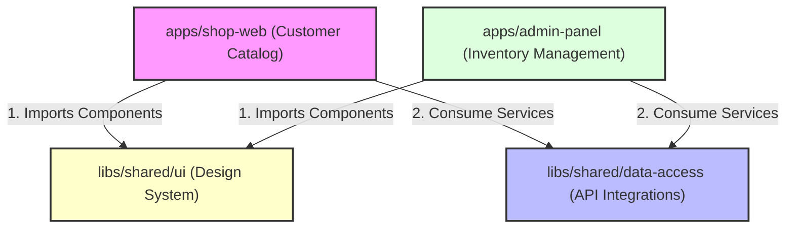

# TechGear Inventory Pro — Enterprise B2B E-Commerce & Inventory Platform

## Overview
**TechGear Inventory Pro** es una plataforma B2B de comercio electrónico y control de almacenes. Diseñada como un monorepo administrado por **Nx**, la arquitectura desacopla el portal comercial de cara al público del panel de administración interna, permitiendo que ambos proyectos compartan un sistema de diseño visual unificado y una capa de datos robusta, acelerando el desarrollo de software y garantizando la coherencia de datos.

- **Problema**: Inconsistencias de stock y duplicación de código en la gestión de inventarios y canales de venta B2B al usar repositorios frontend aislados.
- **Objetivo**: Proporcionar un monorepo integrado que asegure una única fuente de verdad para el dominio del negocio.
- **Valor técnico**: Arquitectura basada en librerías desacopladas de datos (`data-access`) y componentes visuales reutilizables (`shared/ui`) con tipado estricto.

## Architecture

El proyecto se gestiona como un monorepo modular bajo Nx que desacopla la aplicación pública (Storefront) de la aplicación de control operativo (Admin Panel).

### Componentes de la Arquitectura:
- **apps**:
  * `shop-web`: Aplicación orientada al cliente final para el catálogo de productos y checkout.
  * `admin-panel`: Consola de operaciones internas para control de stock, almacenes y permisos de usuario.
- **libs**:
  * `shared/ui`: Biblioteca común de componentes atómicos visuales (Design System) acoplados a Tailwind CSS.
  * `shared/data-access`: Capa compartida de conexión HTTP, mapeo DTO e integración con bases de datos o APIs externas.
  * `features`: Componentes complejos y flujos de negocio reutilizables entre ambas aplicaciones.
- **boundaries**: Restricciones de importación estáticas de Nx declaradas en `eslint.config.mjs` que impiden que los componentes de negocio administrativos contaminen el flujo comercial público.

## Engineering Decisions

### RBAC (Role-Based Access Control)
*   **Decisión**: Implementación de guardias funcionales seguros en el enrutador de Angular que decodifican la firma del JWT y validan los roles asociados a operaciones de stock antes de permitir la navegación.
*   **Trade-off**: Si los permisos cambian en base de datos en tiempo real, el cliente no lo detectará hasta que el token expire o el servidor web de backend rechace la consulta de datos protegidos.

### Authentication Strategy
*   **Decisión**: Flujo de inicio de sesión basado en JSON Web Tokens (JWT).
*   **Trade-off**: *Pendiente de implementación o evidencia* (Los tokens se guardan actualmente en almacenamiento local; se debe documentar o migrar el flujo para utilizar cookies firmadas con atributos `HttpOnly`, `Secure` y `SameSite` para bloquear el acceso de scripts maliciosos XSS).

### Zod Validation Approach
*   **Decisión**: Validación estricta de esquemas de respuesta HTTP en runtime mediante Zod en la capa `@techgear/data-access`.
*   **Trade-off**: Incrementa marginalmente el bundle size de las llamadas de red al incluir el parseador de Zod, pero blinda el flujo reactivo de las Signals frente a estructuras de red inesperadas.

### State Management
*   **Decisión**: Manejo del estado local y global mediante `@ngrx/signals`, encapsulando comportamientos en tiendas ligeras y reactivas libres de zone.js.
*   **Trade-off**: Carece de la madurez de herramientas complejas de auditoría e historial de cambios que posee Redux DevTools.

## Security

- **Guards**: Guardias de enrutamiento funcionales (`AuthGuard`, `RoleGuard`) para aislar los límites de las vistas.
- **Authentication**: Autenticación centralizada JWT.
- **Authorization**: *Pendiente de implementación o evidencia* (Es necesario añadir restricciones de visualización de botones y componentes de acción basados en permisos finos y no solo en roles de usuario globales).

## Testing

- **Unit Testing**: Suites unitarias ejecutadas mediante Vitest utilizando compilación rápida con SWC sobre componentes de datos comunes.
- **E2E**: Pruebas de integración total con Playwright simulando el flujo completo de compra por un usuario en `shop-web` y su reflejo inmediato en el inventario visualizado en `admin-panel`.

## CI/CD
El pipeline en GitHub Actions aprovecha el grafo de dependencias de Nx.
1. `prepare`: Inicialización de Husky hooks locales.
2. `typecheck`: Compilación estricta y comprobación de tipos de TypeScript.
3. `lint`: Análisis estático y verificación de ESLint en todos los proyectos modificados del monorepo.
4. `test`: Ejecución de tests unitarios rápidos mediante Vitest.
5. `build`: Compilación final de los artefactos de producción.

## Deployment
- **Flujo de Despliegue**: *Pendiente de implementación o evidencia* (Es necesario documentar el flujo de despliegue continuo automatizado hacia infraestructura en la nube y la invalidación de caché en CDN).
